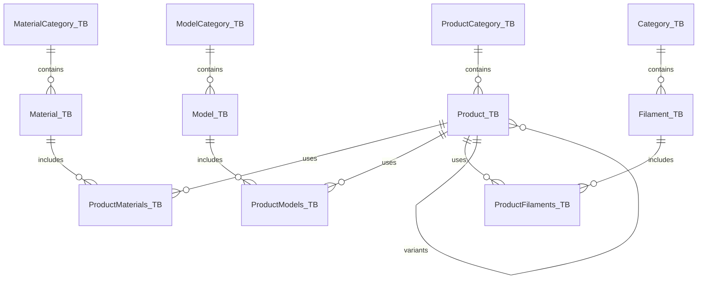

# 🗄️ Database Schema

Filamentify uses **SQLite** through the `better-sqlite3` library. This document outlines the data structures and relationships within the system.

> [!NOTE]
> The live database file is located at `data/filamentify.sqlite` and is ignored by Git. 
> The schema source of truth is [`apps/server/src/db.ts`](../apps/server/src/db.ts).

---

## 🗺️ Entity Relationship Diagram

---

## 📋 Core Tables

### 🏷️ Categories
Standardized category tables for various inventory types.

| Table Name | Fields | Description |
| :--- | :--- | :--- |
| `Category_TB` | `ID`, `Name` | Filament categories |
| `ModelCategory_TB` | `ID`, `Name` | 3D model categories |
| `MaterialCategory_TB` | `ID`, `Name` | Non-filament material categories |
| `ProductCategory_TB` | `ID`, `Name` | Sellable product categories |

---

### 🧶 `Filament_TB`
Tracks filament inventory and stock levels.

| Field | Type | Description |
| :--- | :--- | :--- |
| `ID` | INTEGER | Primary Key |
| `CategoryID` | INTEGER | Foreign Key to `Category_TB` |
| `Name` | TEXT | Display name |
| `Color` | TEXT | Hex code or name |
| `Price` | REAL | Purchase price |
| `Gram` | INTEGER | Total weight |
| `Available_Gram` | INTEGER | Remaining weight |
| `Status` | TEXT | Current state |
| `Score` | INTEGER | Quality rating |
| `Link` | TEXT | Purchase URL |

---

### 🧊 `Model_TB`
Definitions for 3D printed models.

| Field | Type | Description |
| :--- | :--- | :--- |
| `ID` | INTEGER | Primary Key |
| `CategoryID` | INTEGER | Foreign Key to `ModelCategory_TB` |
| `Name` | TEXT | Model name |
| `Link` | TEXT | Source URL (Printables, Thingiverse, etc.) |
| `Gram` | INTEGER | Estimated weight per print |
| `FilePath` | TEXT | Path to local STL/3MF file |
| `PieceCount` | INTEGER | Number of parts |

---

### 🛠️ `Material_TB`
Supplementary inventory (bearings, screws, packaging).

| Field | Type | Description |
| :--- | :--- | :--- |
| `ID` | INTEGER | Primary Key |
| `CategoryID` | INTEGER | Foreign Key to `MaterialCategory_TB` |
| `Name` | TEXT | Material name |
| `Quantity` | INTEGER | Stock count |
| `TotalPrice` | REAL | Total cost for the quantity |
| `UsagePerUnit` | INTEGER | How much is used per product |

---

### 🛒 `Product_TB`
Final sellable product records.

| Field | Type | Description |
| :--- | :--- | :--- |
| `ID` | INTEGER | Primary Key |
| `Name` | TEXT | Product title |
| `Description` | TEXT | Detailed info |
| `Price` | REAL | Selling price |
| `Stock` | INTEGER | Inventory count |
| `ImageFront` | TEXT | Filename in `data/uploads/` |
| `ImageBack` | TEXT | Filename in `data/uploads/` |
| `ProfitMultiplier` | REAL | Calculation helper |
| `ParentID` | INTEGER | Self-referencing FK for variants |

---

## 🔗 Relationship Tables

These tables handle the Many-to-Many relationships between Products and their components.

| Table Name | Primary Fields | Extra Fields |
| :--- | :--- | :--- |
| `ProductMaterials_TB` | `ProductID`, `MaterialID` | `Quantity` |
| `ProductModels_TB` | `ProductID`, `ModelID` | `Quantity` |
| `ProductFilaments_TB` | `ProductID`, `FilamentID` | `Quantity` |

---

## 💡 Implementation Notes

- **Foreign Keys**: Enabled at runtime via `PRAGMA foreign_keys = ON`.
- **Transactions**: Complex operations (like Product updates) are wrapped in atomic transactions.
- **File Storage**: Only file names are stored in the DB; actual binaries reside in `data/uploads/`.

---

[⬅️ Back to README](../README.md)
