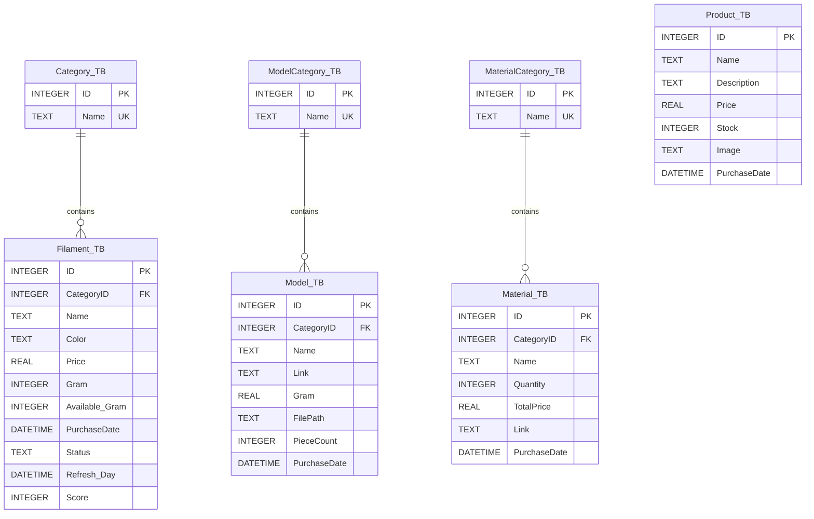

# Filamentify Database Schema & Report

This document provides a comprehensive overview of the **Filamentify** database structure, tables, and column details. The project uses **SQLite** as the database engine with the **better-sqlite3** library.

## Database File
*   **File Name:** `Filamentify_DB.sqlite`
*   **Location:** `apps/server/Filamentify_DB.sqlite`

---

## Entity Relationship Diagram

---

## Table Details

### 1. Filament Management

#### Table: Category_TB
Stores categories for filaments (e.g., PLA, ABS, PETG).

| Column | Type | Attributes | Description |
| :--- | :--- | :--- | :--- |
| **ID** | INTEGER | PK, AUTOINC | Unique ID for the category. |
| **Name** | TEXT | NOT NULL, UNIQUE | Name of the category. |

#### Table: Filament_TB
Main table for tracking filament inventory.

| Column | Type | Attributes | Description |
| :--- | :--- | :--- | :--- |
| **ID** | INTEGER | PK, AUTOINC | Unique ID for the filament spool. |
| **CategoryID** | INTEGER | FK (Category_TB.ID) | Linked category ID. |
| **Name** | TEXT | - | Custom name for the filament. |
| **Color** | TEXT | NOT NULL | Hex color code (e.g., #000000). |
| **Price** | REAL | NOT NULL | Purchase price. |
| **Gram** | INTEGER | NOT NULL | Total weight in grams. |
| **Available_Gram** | INTEGER | NOT NULL | Current remaining weight. |
| **PurchaseDate** | DATETIME | DEFAULT NOW | Date of purchase. |
| **Status** | TEXT | DEFAULT 'Active' | Current status (Active, Empty, etc.). |
| **Refresh_Day** | DATETIME | DEFAULT NOW | Last updated timestamp. |
| **Score** | INTEGER | DEFAULT 0 | Usage frequency score. |

---

### 2. Model Management

#### Table: ModelCategory_TB
Categories for 3D models (e.g., Tools, Figures, Functional).

| Column | Type | Attributes | Description |
| :--- | :--- | :--- | :--- |
| **ID** | INTEGER | PK, AUTOINC | Unique ID for the category. |
| **Name** | TEXT | NOT NULL, UNIQUE | Name of the category. |

#### Table: Model_TB
Stores 3D models and their technical requirements.

| Column | Type | Attributes | Description |
| :--- | :--- | :--- | :--- |
| **ID** | INTEGER | PK, AUTOINC | Unique ID for the model. |
| **CategoryID** | INTEGER | FK (ModelCategory_TB.ID) | Linked category ID. |
| **Name** | TEXT | NOT NULL | Name of the model. |
| **Link** | TEXT | - | Source URL (Thingiverse, Printables, etc.). |
| **Gram** | REAL | NOT NULL | Estimated material weight needed. |
| **FilePath** | TEXT | - | Local file path for the model. |
| **PieceCount** | INTEGER | DEFAULT 1 | Number of pieces in the model. |
| **PurchaseDate** | DATETIME | DEFAULT NOW | Date added. |

---

### 3. Material Management

#### Table: MaterialCategory_TB
Categories for non-filament materials (e.g., Bearings, Screws, Resins).

| Column | Type | Attributes | Description |
| :--- | :--- | :--- | :--- |
| **ID** | INTEGER | PK, AUTOINC | Unique ID for the category. |
| **Name** | TEXT | NOT NULL, UNIQUE | Name of the category. |

#### Table: Material_TB
Inventory for supplementary 3D printing materials.

| Column | Type | Attributes | Description |
| :--- | :--- | :--- | :--- |
| **ID** | INTEGER | PK, AUTOINC | Unique ID for the material. |
| **CategoryID** | INTEGER | FK (MaterialCategory_TB.ID) | Linked category ID. |
| **Name** | TEXT | NOT NULL | Name of the material. |
| **Quantity** | INTEGER | DEFAULT 1 | Current stock quantity. |
| **TotalPrice** | REAL | DEFAULT 0 | Total cost for the stock. |
| **Link** | TEXT | - | Purchase link. |
| **PurchaseDate** | DATETIME | DEFAULT NOW | Date of purchase. |

---

### 4. Product Management

#### Table: Product_TB
Ready-to-sell products (printed and finished).

| Column | Type | Attributes | Description |
| :--- | :--- | :--- | :--- |
| **ID** | INTEGER | PK, AUTOINC | Unique ID for the product. |
| **Name** | TEXT | NOT NULL | Product name. |
| **Description** | TEXT | - | Product description. |
| **Price** | REAL | NOT NULL | Sale price. |
| **Stock** | INTEGER | DEFAULT 0 | Units available for sale. |
| **Image** | TEXT | - | Image file path or URL. |
| **PurchaseDate** | DATETIME | DEFAULT NOW | Production/Addition date. |

---

## Veri Tipleri ve Kısıtlamalar (Notes)
1.  **REAL:** Ondalıklı sayıları (Fiyat vb.) tutmak için kullanılır.
2.  **INTEGER:** Tam sayıları (ID, Gram vb.) tutmak için kullanılır.
3.  **TEXT:** Metinleri ve Hex kodlarını tutmak için kullanılır.
4.  **DATETIME:** SQLite'da ISO 8601 string formatında saklanır.
5.  **FOREIGN KEY:** Tüm ilişkilerde `CASCADE` veya `SET NULL` kontrolleri uygulama katmanında (Express) yönetilmektedir.

