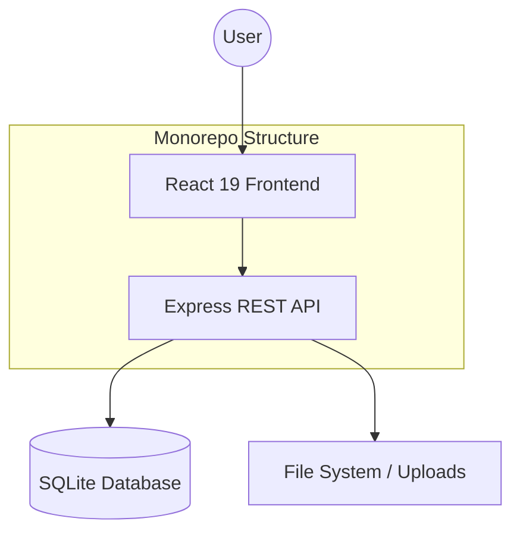

<h1 align="center">Filamentify</h1>

<p align="center">
  <strong>The Ultimate 3D Printing Management Suite</strong>
</p>

<p align="center">
  
  
  
  
  
</p>

<p align="center">
  <a href="#-overview">Overview</a> •
  <a href="#-features">Features</a> •
  <a href="#-tech-stack">Tech Stack</a> •
  <a href="#-getting-started">Getting Started</a> •
  <a href="#-architecture">Architecture</a> •
  <a href="#-contributing">Contributing</a>
</p>

---

## 🌟 Overview

**Filamentify** is a professional-grade, all-in-one management system designed for 3D printing enthusiasts and print farms. It streamlines the complex workflow of tracking filament stock, managing 3D model libraries, and monitoring non-filament materials—all within a stunning, high-performance interface.

> [!TIP]
> Boost your productivity by automating material cost calculations and never run out of filament mid-print again.

---

## ✨ Features

### 🧵 Intelligent Filament Tracking
- **Real-time Inventory**: Track grams remaining, colors (hex codes), and purchase dates.
- **Dynamic Status**: Automatically marks spools as active, low, or empty.
- **Cost Analysis**: Monitor your spending with integrated price tracking.

### 📁 Advanced Model Library
- **3D Asset Management**: Organize your STLs and G-Codes with piece counts and material requirements.
- **Source Linking**: Direct links to Thingiverse, Printables, or local file paths.

### 🛠️ Material & Product Management
- **Hardware Inventory**: Track screws, bearings, and other essential hardware.
- **Sales Ready**: Manage printed product stock and production history for businesses.

### 🌍 Modern & Bilingual
- **Premium UI**: Built with a monochromatic dark theme, glassmorphism, and smooth animations.
- **Full i18n**: Seamlessly switch between **English** and **Turkish**.

---

## 💻 Tech Stack

### Frontend
- **Framework**: React 19 (Vite)
- **Styling**: Tailwind CSS 4.0
- **UI Components**: Radix UI + Shadcn/UI
- **Icons**: Lucide React
- **Localization**: React-i18next

### Backend
- **Runtime**: Node.js + Express
- **Database**: Better-SQLite3
- **File Handling**: Multer

---

## 🏗️ Architecture



---

## 🛠️ Getting Started

### Prerequisites
- **Node.js** (v18.0.0 or higher)
- **npm** (v9.0.0 or higher)

### Installation

1. **Clone the repository**
   ```bash
   git clone https://github.com/beydah/Filamentify.git
   cd Filamentify
   ```

2. **Setup the Server**
   ```bash
   cd apps/server
   npm install
   npm run dev
   ```

3. **Setup the Client**
   ```bash
   cd apps/client
   npm install
   npm run dev
   ```

The application will be available at `http://localhost:5173` (Client) and `http://localhost:3001` (Server).

---

## 📄 Related Documents

- 📊 **[Database Schema](./DATABASE_SCHEMA.md)** - Technical breakdown of the SQLite structure.
- 🤝 **[Contributing Guidelines](./CONTRIBUTING.md)** - How to help us grow.
- 🛡️ **[Security Policy](./SECURITY.md)** - Reporting vulnerabilities.
- 📜 **[Code of Conduct](./CODE_OF_CONDUCT.md)** - Community standards.

---

## ⚖️ License

Distributed under the MIT License. See `LICENSE` for more information.

<p align="center">
  Made with ❤️ by <a href="https://github.com/beydah">beydah</a>
</p>
